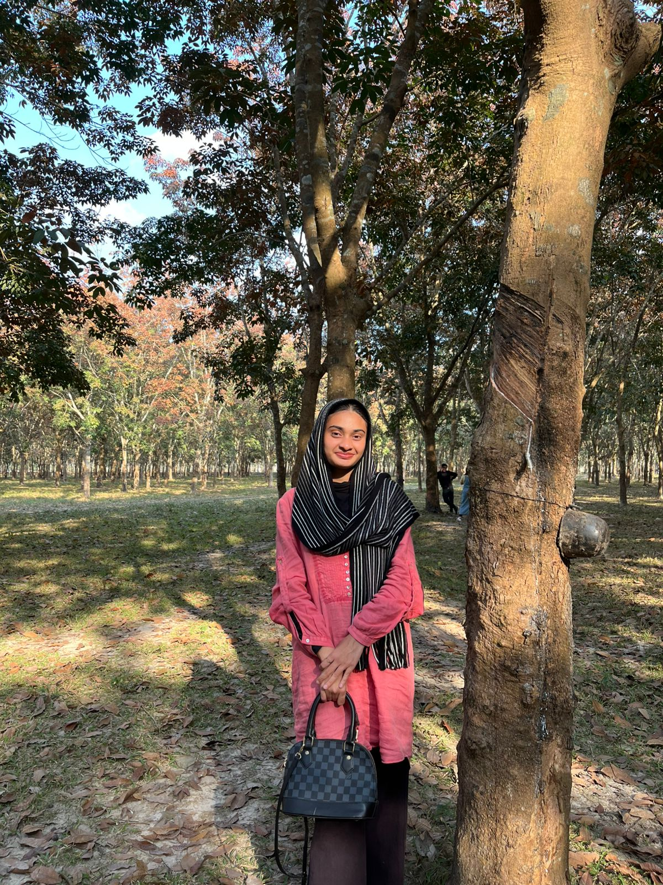

# Samia Fabiha 

  

## Career Objective  
I am a CSE student interested in Flutter and web development. I want to build user-friendly applications and improve my programming skills.

---

## Education  
B.Sc. in Computer Science & Engineering  
(Your University Name)  

---

## Skills  
- Flutter & Dart  
- HTML, CSS, Bootstrap  
- Java  

---

## Projects  

### EduNOVA Study Planner  
A study planner app with calendar and reminders.  

### Banking App  
Android app with login, send money, and transaction history.  

---

## Contact  
Email: samiafabiha2020@gmail.com  
GitHub: https://github.com/samiafabiha.assignment.io  
